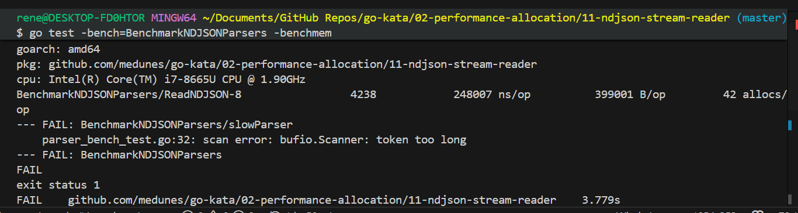
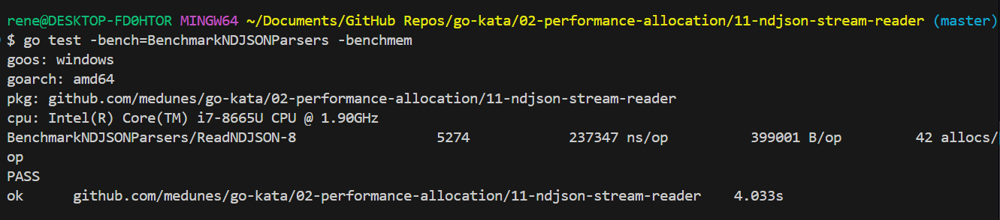

# Results

I compared the two NDJSON parsers on the same 64KB fixture:

- `ReadNDJSON` in [`ndJSONParser.go`](ndJSONParser.go), which uses `bufio.Reader`
- `slowParser` in [`other.go`](other.go), which uses `bufio.Scanner`

## What the screenshots show

The first run failed in the scanner-based parser:

The error is the classic `bufio.Scanner: token too long` failure. That means the input line exceeded the scanner's default token limit, so the benchmark aborted before it could finish comparing both parsers.

After increasing the scanner buffer, the benchmark completed:

## Benchmark summary

From the successful run:

- `ReadNDJSON`: `237347 ns/op`, `399001 B/op`, `42 allocs/op`

## Takeaway

The numbers do not mean the scanner version is a better parser. They mean the scanner version only becomes benchmarkable after relaxing its default size limit.

The important result is behavioral:

- `ReadNDJSON` handles the 64KB NDJSON line without special configuration.
- `slowParser` fails on the same input unless the scanner buffer is increased.

If the goal is real NDJSON streaming with long lines, the `bufio.Reader` implementation is the one that survives the workload as written.

